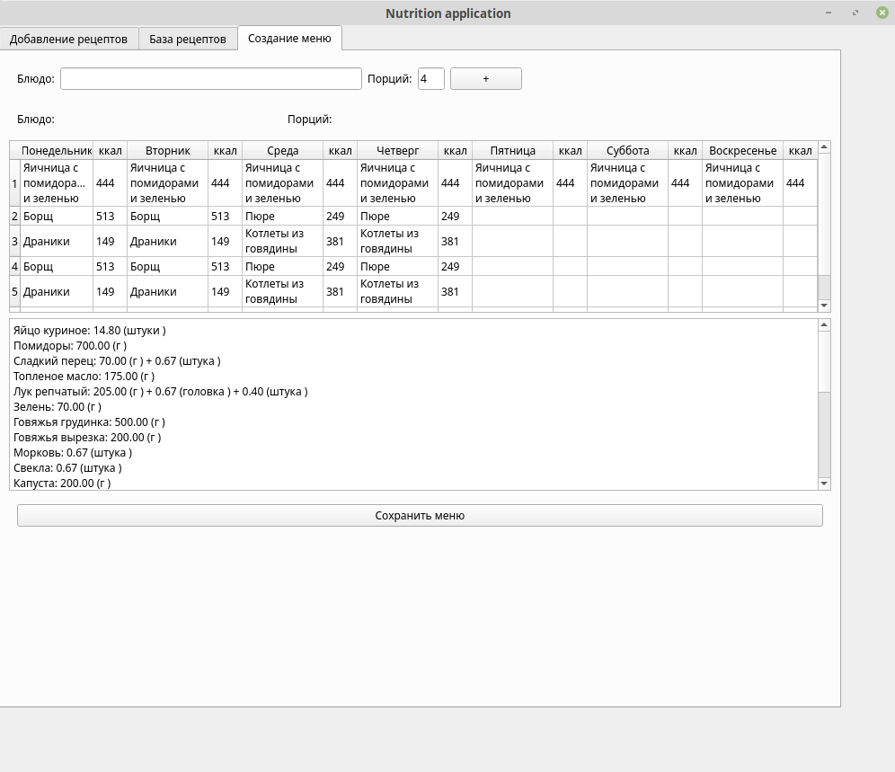

# Nutrition application

**Status:**
[](https://travis-ci.org/healty-diet/nutrition)

## Overview

This is a native application based on Pyside2/Qt to build your diet plan for a week.

Key features:

- Creating recipes with calculated energy value.
- Managing recipes library
- Creating a menu from recipes with respect to serves amount
- Managing menu energy value
- Creating a shopping list based on menu
- Export of menu and shopping list into `.xls` format.



## Language support

Currently only Russian language is supported, but English language support can easily be added upon request.

## Install and run

To install, simply run:

```sh
pip install -e nutrition
```

To run, you have to create a folder for application data.
Then, you need to create a config file (e.g. ".nutrition_config") with the following structure:

```json
{
  "application_folder": "/home/user/nutrition_data",
}
```

The folder with application data expects to have a `calories.json` file (which can be obtained via [Calorizator parser](https://github.com/healty-diet/calorizator_parser) script) and `recipes` folder with recipes in `json` format (which can be obtained via [Eda.ru parser](https://github.com/healty-diet/eda_ru_parser)).

Otherwise you can provide the data manually.

Expected file format for `calories.json`:

```python
{
    "name1": {"protein": 0.0, "fat": 0.0, "carbohydrates": 0.0, "calories": 0.0},
    "name2": {"protein": 0.0, "fat": 0.0, "carbohydrates": 0.0, "calories": 0.0},
    ...
}
```

Expected file names for `recipes` folder are `0.json`, `1.json`, etc. The folder may be empty, if you're going to create every recipe manually.

Expceted file format for `{N}.json`:

```python
{
  "name": "recipe_name",
  "serves_amount": 1,
  "ingredients": [
    {
      "ingredient_1": {
        "measure_name (e.g. gr.)": 2.0
      }
    },
  ],
  "text": "1. Step 1\n2. Step 2\n3. Step 3\n",
  "energy_value_per_serving": {
    "calories": "0",
    "protein": "0",
    "fat": "0",
    "carbohydrates": "0"
  }
}
```

After that you can run the application as following:

```sh
python -m nutrition --config=/path/to/.nutrition_config
```

## LICENSE

The project is licensed under GNU General Public Licence v3.
See [LICENSE](LICENSE) for more information.
